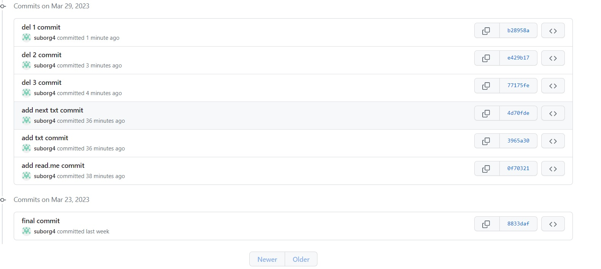
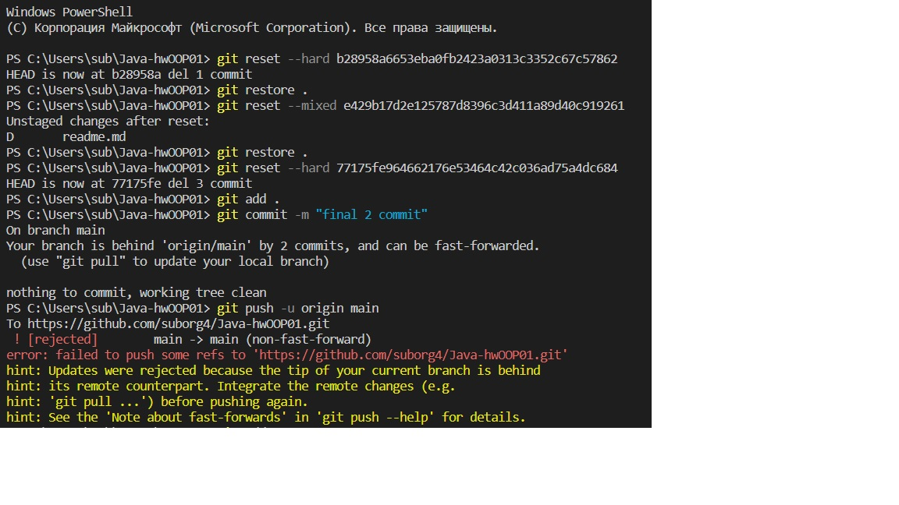

<h1 align="center">Всем привет, меня зовут Борис</a> 
</h1>
<h3 align="center">Я учусь на курсах GeekBrains</h3>
<h3 align="center">1 правило GeekBrains - никому не рассказывай о GeekBrains</h3>

Это практическое задание по ООП на тему "Создать наследника реализованного класса", но речь будет не о нем, а о задании по углубленному гиту №2

Урок 2. Работа с изменениями
Данное домашнее задание является продолжением домашнего задания, которое вы выполняли на предыдущем семинаре в репозитории с собственным проектом.

1. Просмотрите историю коммитов в своём проекте и выберите три случайных коммита. Просмотрите изменения, которые были в них сделаны.

2. Верните эти изменения командой git revert последовательно, чтобы в итоге получилось тоже три коммита.

3. Попробуйте отменить эти три коммита:
* последний — командами git reset --soft и git restore;
* предпоследний — командой git reset --mixed и git restore;
* первый — командой git reset --hard.

Частичный отчет в рисунках ниже
</h1>
</h1>